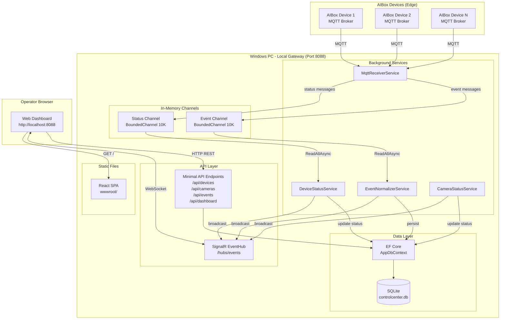
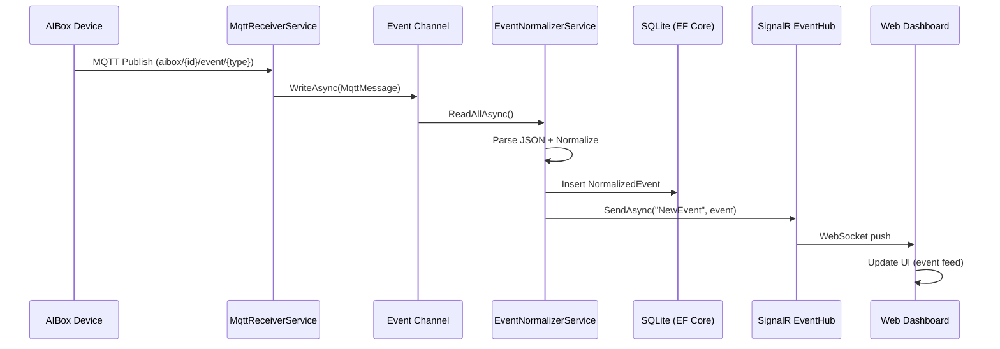
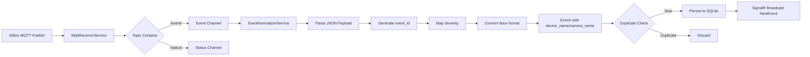
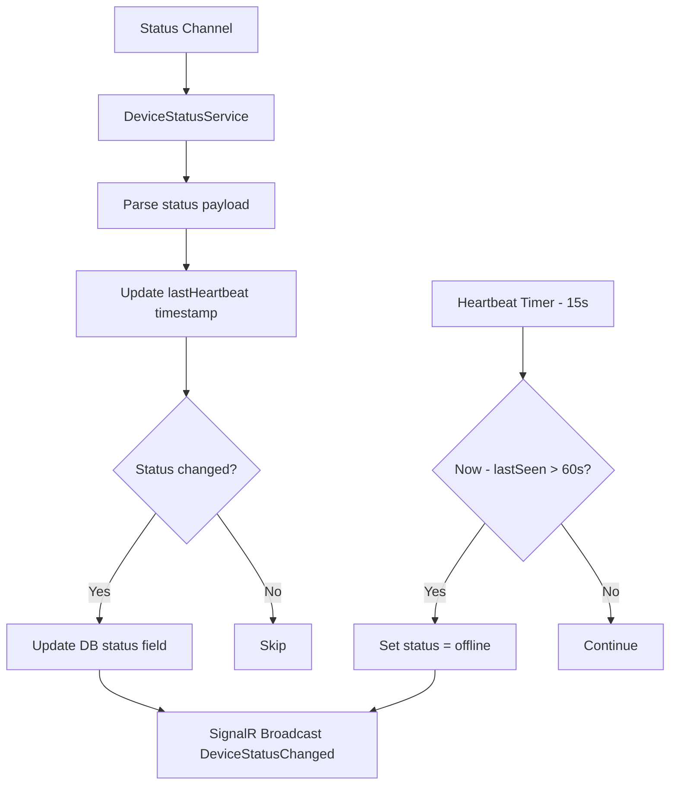
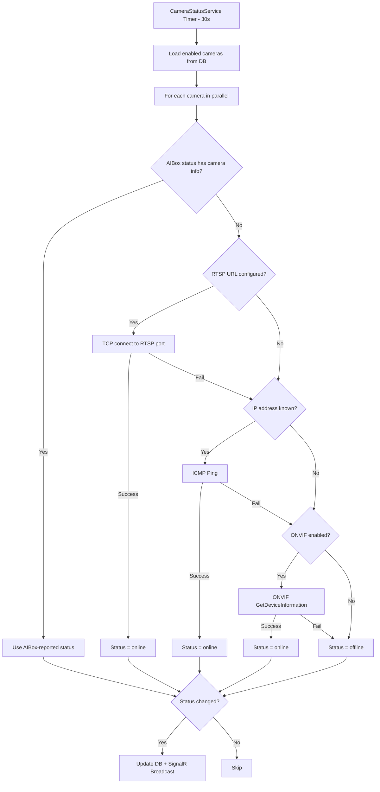
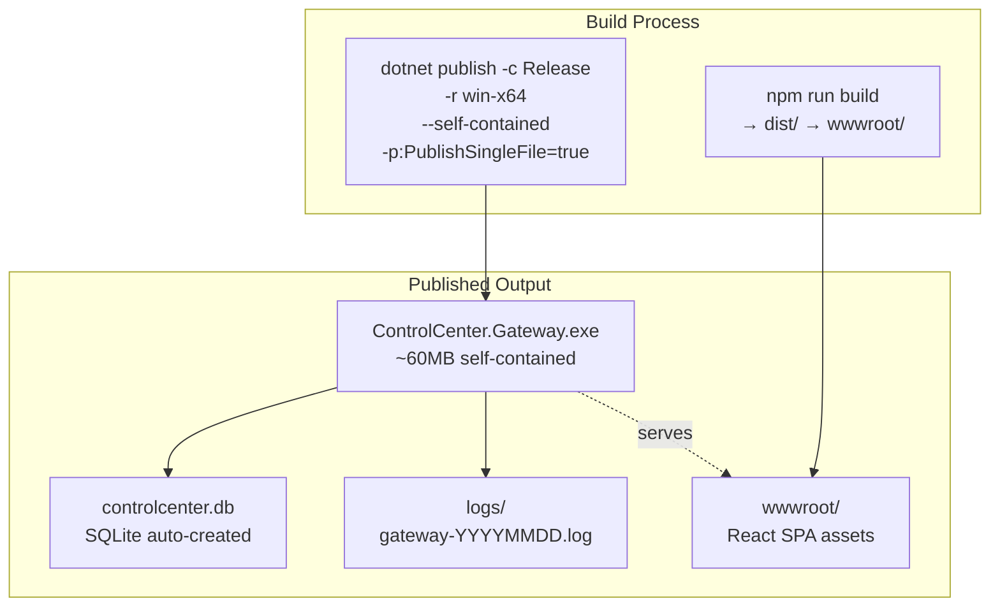

# Design Document: Windows Local Control Center

## Overview

The Windows Local Control Center is a self-contained local monitoring system for AIBox edge computing devices and network cameras. It provides real-time event ingestion, normalization, persistence, and visualization through a single Windows executable serving both the backend API and a web-based dashboard.

**Key Design Goals:**
- **Single-Executable Deployment**: .NET 8 self-contained publish with React SPA embedded as static files
- **Real-Time Processing**: MQTT → Channel\<T\> pipeline → SQLite persistence → SignalR broadcast
- **Offline-First**: Fully functional without internet; sync metadata stored for future AWS cloud integration
- **Multi-Device Support**: Concurrent MQTT connections to 10+ AIBox brokers with independent heartbeat tracking

**Technology Stack:**
| Layer | Technology |
|-------|-----------|
| Backend Runtime | .NET 8 (ASP.NET Core Minimal API) |
| Frontend | React 18 + TypeScript + Vite |
| Database | SQLite (via EF Core) |
| MQTT Client | MQTTnet 4.x |
| Real-time Push | SignalR |
| Logging | Serilog (Console + Rolling File) |
| Deployment | Single-file self-contained Windows x64 executable |

## Architecture

### High-Level Architecture Diagram



### Component Interaction Sequence



## Components and Interfaces

### 1. MqttReceiverService (Background Service - Singleton)

**Responsibility:** Manages MQTT client connections to all enabled AIBox device brokers. Routes incoming messages to the appropriate in-memory channel based on topic.

**Interfaces:**
```csharp
public class MqttReceiverService : BackgroundService
{
    // Public channel readers for downstream consumers
    public ChannelReader<MqttMessage> EventReader { get; }
    public ChannelReader<MqttMessage> StatusReader { get; }
}

public class MqttMessage
{
    public string Topic { get; set; }
    public string Payload { get; set; }
    public string DeviceId { get; set; }
}
```

**Design Decisions:**
- Uses `BoundedChannel<MqttMessage>` with capacity 10,000 and `DropOldest` overflow policy to prevent memory exhaustion
- One `IMqttClient` per device stored in `ConcurrentDictionary<string, IMqttClient>`
- Automatic reconnection on disconnect with 5-second delay
- Polls database every 30 seconds to discover newly registered devices
- Topic routing: messages containing `/event/` → EventChannel, `/status/` → StatusChannel

### 2. EventNormalizerService (Background Service - Hosted)

**Responsibility:** Consumes raw MQTT event messages from the Event Channel, transforms them into the Standard Event Schema, deduplicates, persists to SQLite, and broadcasts via SignalR.

**Interfaces:**
```csharp
public class EventNormalizerService : BackgroundService
{
    // Consumes from MqttReceiverService.EventReader
    // Writes to AppDbContext.Events
    // Broadcasts via IHubContext<EventHub>
}
```

**Design Decisions:**
- Single-reader pattern on the event channel for ordered processing
- Generates deterministic `event_id` from `{device_id}-{ts_ms}-{event_type}-{camera_id}-{track_id}`
- Uses `AnyAsync` check + catch `DbUpdateException` for duplicate handling (double-check pattern)
- Severity lookup via static `Dictionary<string, string>` for O(1) classification
- Stores `raw_payload` verbatim for forensics and future re-processing

### 3. DeviceStatusService (Background Service - Hosted)

**Responsibility:** Consumes MQTT status messages to track device heartbeats. Runs periodic heartbeat timeout checks to detect offline devices.

**Interfaces:**
```csharp
public class DeviceStatusService : BackgroundService
{
    // Consumes from MqttReceiverService.StatusReader
    // Updates device status in AppDbContext
    // Broadcasts via IHubContext<EventHub>
}
```

**Design Decisions:**
- Uses `ConcurrentDictionary<string, DateTime>` for last-heartbeat tracking (lock-free)
- Heartbeat timeout: 60 seconds (configurable via `appsettings.json`)
- Heartbeat check interval: 15 seconds
- Status values: `online`, `offline`, `warning`, `unknown`, `disabled`
- Only broadcasts when status actually changes (avoids notification spam)

### 4. CameraStatusService (Background Service - Hosted)

**Responsibility:** Determines camera online/offline status using a prioritized checking strategy.

**Status Check Priority (Waterfall):**
1. **AIBox Payload**: If the AIBox status message contains `camera_status` data, use it directly
2. **RTSP Probe**: Attempt TCP connection to RTSP port (default 554) with 3-second timeout
3. **ICMP Ping**: Send ICMP echo to camera IP with 2-second timeout
4. **ONVIF GetDeviceInformation**: If ONVIF is enabled, query the camera's ONVIF endpoint

```csharp
public class CameraStatusService : BackgroundService
{
    // Check interval: 30 seconds
    // Timeout per method: 3 seconds
    // Fallback chain: AIBox → RTSP → Ping → ONVIF
}
```

**Design Decisions:**
- Waterfall approach: first successful check wins, remaining methods skipped
- Check interval: 30 seconds per camera
- Parallel checking across cameras using `Task.WhenAll` with concurrency limit (SemaphoreSlim, max 5)
- AIBox status payload takes priority because it reflects real-time camera feed status from the edge device

### 5. REST API Endpoints (Minimal API)

**Responsibility:** Provide CRUD operations and data queries for devices, cameras, events, and dashboard statistics.

**Endpoint Groups:**
- `/api/devices` — Device CRUD
- `/api/cameras` — Camera CRUD
- `/api/events` — Event listing, filtering, acknowledgment, memos, export
- `/api/dashboard` — Summary statistics

### 6. SignalR EventHub

**Responsibility:** WebSocket-based real-time message broker between server-side events and connected dashboard clients.

**Hub Path:** `/hubs/events`

**Messages (Server → Client):**
- `NewEvent` — New normalized event
- `DeviceStatusChanged` — Device status transition
- `CameraStatusChanged` — Camera status transition
- `EventAcknowledged` — Event acknowledgment update
- `EventMemoUpdated` — Action memo update

### 7. Web Dashboard (React SPA)

**Responsibility:** Operator interface for monitoring, event management, and device configuration.

**Served from:** `/wwwroot/` as static files with SPA fallback to `index.html`

**Key Pages:**
- Dashboard (summary statistics, event feed)
- Devices (list, detail, create, edit)
- Cameras (list, detail, create, edit)
- Events (list with filters, detail modal, acknowledgment, export)

## Data Models

### Database Schema

```mermaid
erDiagram
    Devices {
        TEXT device_id PK
        TEXT device_name
        TEXT site_id
        TEXT site_name
        TEXT location
        TEXT ip_address
        TEXT mqtt_host
        INTEGER mqtt_port
        TEXT mqtt_username
        TEXT mqtt_password
        TEXT event_topic
        TEXT status_topic
        INTEGER enabled
        TEXT description
        TEXT created_at
        TEXT updated_at
        TEXT status
    }

    Cameras {
        TEXT camera_id PK
        TEXT camera_name
        TEXT site_id
        TEXT site_name
        TEXT device_id FK
        INTEGER channel_no
        TEXT location
        TEXT ip_address
        TEXT rtsp_url
        INTEGER onvif_enabled
        TEXT onvif_host
        TEXT onvif_username
        TEXT onvif_password
        TEXT status
        INTEGER enabled
        TEXT description
        TEXT created_at
        TEXT updated_at
    }

    Events {
        TEXT event_id PK
        TEXT schema_version
        TEXT tenant_id
        TEXT site_id
        TEXT site_name
        TEXT device_id
        TEXT device_name
        TEXT camera_id
        TEXT camera_name
        TEXT event_type
        TEXT severity
        TEXT timestamp
        INTEGER ts_ms
        INTEGER track_id
        TEXT bbox
        REAL confidence
        INTEGER roi_id
        TEXT roi_name
        TEXT snapshot_url
        TEXT clip_url
        TEXT model_version
        TEXT edge_app_version
        TEXT ack_status
        TEXT ack_user
        TEXT ack_time
        TEXT action_memo
        TEXT sync_status
        INTEGER sync_retry_count
        TEXT last_sync_time
        TEXT cloud_event_id
        TEXT sync_error_message
        TEXT raw_payload
        TEXT received_at
    }

    Devices ||--o{ Cameras : "has"
    Devices ||--o{ Events : "generates"
    Cameras ||--o{ Events : "captures"
```



### Standard Event Schema (Full Field Specification)

| Field | Type | Required | Default | Description |
|-------|------|----------|---------|-------------|
| event_id | string | Yes | generated | Composite key: `{device_id}-{ts_ms}-{event_type}-{camera_id}-{track_id}` |
| schema_version | string | Yes | "1.0" | Event schema version for forward compatibility |
| tenant_id | string | Yes | "default" | Multi-tenant identifier for future cloud use |
| site_id | string | No | null | Site identifier from device registration |
| site_name | string | No | null | Human-readable site name |
| device_id | string | Yes | — | AIBox device identifier |
| device_name | string | No | null | Human-readable device name (enriched from DB) |
| camera_id | string | Yes | — | Camera channel identifier |
| camera_name | string | No | null | Human-readable camera name (enriched from DB) |
| event_type | string | Yes | "UNKNOWN_EVENT" | One of the defined event type constants |
| severity | string | Yes | "LOW" | HIGH, MEDIUM, or LOW |
| timestamp | string | Yes | — | ISO 8601 timestamp from source |
| ts_ms | long | Yes | — | Unix epoch milliseconds for indexing/sorting |
| track_id | int | No | 0 | Object tracking ID from AI model |
| bbox | string (JSON) | No | null | Bounding box as JSON object `{"x":0,"y":0,"w":100,"h":100}` |
| confidence | double | No | 0.0 | AI model confidence score (0.0–1.0) |
| roi_id | int | No | 0 | Region-of-interest identifier |
| roi_name | string | No | null | Human-readable ROI name |
| snapshot_url | string | No | null | URL/path to event snapshot image |
| clip_url | string | No | null | URL/path to event video clip |
| model_version | string | No | null | AI model version running on AIBox |
| edge_app_version | string | No | null | AIBox application version |
| ack_status | string | Yes | "unconfirmed" | Acknowledgment state: unconfirmed, confirmed |
| ack_user | string | No | null | User who acknowledged the event |
| ack_time | DateTime | No | null | When the event was acknowledged |
| action_memo | string | No | null | Operator's action notes |
| sync_status | string | Yes | "pending" | Cloud sync state: pending, queued, synced, failed |
| sync_retry_count | int | Yes | 0 | Number of sync attempts |
| last_sync_time | DateTime | No | null | Last sync attempt timestamp |
| cloud_event_id | string | No | null | Event ID assigned by AWS cloud system |
| sync_error_message | string | No | null | Last sync failure reason |
| raw_payload | string | No | null | Original MQTT JSON payload verbatim |
| received_at | DateTime | Yes | UTC now | Gateway receipt timestamp |

### Event Types and Severity Classification

| Event Type | Severity | Category |
|-----------|----------|----------|
| FALL_DETECTED | HIGH | Safety |
| ROI_INTRUSION | HIGH | Security |
| WORK_ZONE_ENTRY | MEDIUM | Safety |
| HAZARD_PROXIMITY | HIGH | Safety |
| WORK_NO_HELMET | MEDIUM | PPE Compliance |
| WORK_NO_VEST | MEDIUM | PPE Compliance |
| WORK_NO_MASK | MEDIUM | PPE Compliance |
| DEVICE_OFFLINE | HIGH | System |
| CAMERA_OFFLINE | MEDIUM | System |
| SYSTEM_WARNING | MEDIUM | System |
| UNKNOWN_EVENT | LOW | Uncategorized |

### Database Indexes

| Table | Column(s) | Purpose |
|-------|-----------|---------|
| Events | device_id | Filter events by device |
| Events | timestamp | Date range queries |
| Events | event_type | Filter by event type |
| Events | severity | Filter by severity |
| Events | ack_status | Filter unconfirmed events |
| Events | ts_ms | Sort by time (primary sort key) |
| Events | sync_status | Future cloud sync batch queries |
| Cameras | device_id | Join cameras to device |
| Cameras | status | Filter by camera status |
| Devices | status | Filter by device status |

## Data Flow

### Event Ingestion Pipeline



### Event Normalization Detail

1. **Receive**: Raw JSON payload from MQTT message
2. **Parse**: Deserialize using `System.Text.Json.JsonDocument`
3. **Extract Fields**: Pull known fields from JSON; use defaults for missing fields
4. **Generate ID**: Compose deterministic `event_id` from composite key
5. **Classify**: Look up `event_type` in severity map; default to `UNKNOWN_EVENT`/`LOW`
6. **Transform bbox**: If `bbox` is array `[x,y,w,h]`, convert to object `{"x":x,"y":y,"w":w,"h":h}`
7. **Enrich**: Look up `device_name` and `camera_name` from database registration
8. **Set Defaults**: `ack_status = "unconfirmed"`, `sync_status = "pending"`, `sync_retry_count = 0`
9. **Deduplicate**: Check if `event_id` exists in database
10. **Persist**: Insert into SQLite via EF Core
11. **Broadcast**: Push to all SignalR clients

### Device Status Flow



### Camera Status Check Flow



## API Design

### Devices API (`/api/devices`)

| Method | Path | Description | Request Body | Response |
|--------|------|-------------|--------------|----------|
| GET | `/api/devices` | List all devices | — | `Device[]` |
| GET | `/api/devices/{id}` | Get device with cameras | — | `Device` (includes Cameras) |
| POST | `/api/devices` | Create device | `Device` JSON | `201 Created` + Device |
| PUT | `/api/devices/{id}` | Update device | `Device` JSON | `200 OK` + Device |
| DELETE | `/api/devices/{id}` | Delete device + cameras | — | `204 No Content` |

**Device JSON Schema:**
```json
{
  "device_id": "string",
  "device_name": "string (required)",
  "site_id": "string?",
  "site_name": "string?",
  "location": "string?",
  "ip_address": "string?",
  "mqtt_host": "string?",
  "mqtt_port": 1883,
  "mqtt_username": "string?",
  "mqtt_password": "string?",
  "event_topic": "string?",
  "status_topic": "string?",
  "enabled": true,
  "description": "string?",
  "status": "unknown",
  "created_at": "2024-01-01T00:00:00Z",
  "updated_at": "2024-01-01T00:00:00Z"
}
```

### Cameras API (`/api/cameras`)

| Method | Path | Description | Request Body | Response |
|--------|------|-------------|--------------|----------|
| GET | `/api/cameras` | List all cameras | — | `Camera[]` |
| GET | `/api/cameras?device_id={id}` | List cameras for device | — | `Camera[]` |
| GET | `/api/cameras/{id}` | Get camera detail | — | `Camera` |
| POST | `/api/cameras` | Create camera | `Camera` JSON | `201 Created` + Camera |
| PUT | `/api/cameras/{id}` | Update camera | `Camera` JSON | `200 OK` + Camera |
| DELETE | `/api/cameras/{id}` | Delete camera | — | `204 No Content` |

**Camera JSON Schema:**
```json
{
  "camera_id": "string",
  "camera_name": "string (required)",
  "site_id": "string?",
  "site_name": "string?",
  "device_id": "string (required)",
  "channel_no": 0,
  "location": "string?",
  "ip_address": "string?",
  "rtsp_url": "string?",
  "onvif_enabled": false,
  "onvif_host": "string?",
  "onvif_username": "string?",
  "onvif_password": "string?",
  "status": "unknown",
  "enabled": true,
  "description": "string?",
  "created_at": "2024-01-01T00:00:00Z",
  "updated_at": "2024-01-01T00:00:00Z"
}
```

### Events API (`/api/events`)

| Method | Path | Description | Query Params | Response |
|--------|------|-------------|--------------|----------|
| GET | `/api/events` | List events (paginated) | `device_id`, `camera_id`, `event_type`, `severity`, `ack_status`, `start_date`, `end_date`, `page`, `page_size` | Paginated result |
| GET | `/api/events/{id}` | Get event detail | — | `NormalizedEvent` |
| PUT | `/api/events/{id}/ack` | Acknowledge event | `{ "ack_user": "string" }` | Updated event |
| PUT | `/api/events/{id}/memo` | Add/update memo | `{ "action_memo": "string" }` | Updated event |
| GET | `/api/events/export/csv` | Export as CSV | Same filters as list | File download |
| GET | `/api/events/export/excel` | Export as Excel | Same filters as list | File download |

**Paginated Response Schema:**
```json
{
  "items": [ /* NormalizedEvent[] */ ],
  "total": 1234,
  "page": 1,
  "page_size": 50,
  "total_pages": 25
}
```

### Dashboard API (`/api/dashboard`)

| Method | Path | Description | Response |
|--------|------|-------------|----------|
| GET | `/api/dashboard/summary` | Get summary stats | Dashboard summary |

**Dashboard Summary Response:**
```json
{
  "total_devices": 5,
  "online_devices": 3,
  "offline_devices": 2,
  "total_cameras": 20,
  "online_cameras": 15,
  "today_events": 142,
  "unconfirmed_events": 23,
  "high_severity_today": 5
}
```

### SignalR Hub (`/hubs/events`)

**Connection:** WebSocket with automatic fallback to Server-Sent Events / Long Polling

**Server-to-Client Messages:**

| Message | Payload | Trigger |
|---------|---------|---------|
| `NewEvent` | `NormalizedEvent` object | New event persisted |
| `DeviceStatusChanged` | `{ deviceId, status, updatedAt }` | Device status transition |
| `CameraStatusChanged` | `{ cameraId, status, updatedAt }` | Camera status transition |
| `EventAcknowledged` | `{ eventId, ackStatus, ackUser, ackTime }` | Event acknowledged |
| `EventMemoUpdated` | `{ eventId, actionMemo }` | Memo saved |

**SignalR Message Contract Examples:**

```typescript
// NewEvent
interface NewEventMessage {
  eventId: string;
  schemaVersion: string;
  tenantId: string;
  siteId: string | null;
  deviceId: string;
  deviceName: string | null;
  cameraId: string;
  cameraName: string | null;
  eventType: string;
  severity: "HIGH" | "MEDIUM" | "LOW";
  timestamp: string;
  tsMs: number;
  trackId: number;
  bbox: { x: number; y: number; w: number; h: number } | null;
  confidence: number;
  snapshotUrl: string | null;
  clipUrl: string | null;
  ackStatus: "unconfirmed" | "confirmed";
  syncStatus: "pending" | "queued" | "synced" | "failed";
}

// DeviceStatusChanged
interface DeviceStatusChangedMessage {
  deviceId: string;
  status: "online" | "offline" | "warning" | "unknown" | "disabled";
  updatedAt: string;
}

// CameraStatusChanged
interface CameraStatusChangedMessage {
  cameraId: string;
  status: "online" | "offline" | "warning" | "unknown" | "disabled";
  updatedAt: string;
}

// EventAcknowledged
interface EventAcknowledgedMessage {
  eventId: string;
  ackStatus: "confirmed";
  ackUser: string;
  ackTime: string;
}

// EventMemoUpdated
interface EventMemoUpdatedMessage {
  eventId: string;
  actionMemo: string;
}
```

## MQTT Topic Structure

### Current Topics

| Pattern | Direction | Purpose |
|---------|-----------|---------|
| `aibox/{device_id}/event/#` | AIBox → Gateway | Event notifications |
| `aibox/{device_id}/status/#` | AIBox → Gateway | Heartbeat and status |

### Future Topics (Thingswell Integration)

| Pattern | Direction | Purpose |
|---------|-----------|---------|
| `thingswell/{tenant_id}/{site_id}/{device_id}/event/{event_type}` | AIBox → Gateway | Tenant-scoped events |
| `thingswell/{tenant_id}/{site_id}/{device_id}/status` | AIBox → Gateway | Tenant-scoped status |

**Design for Topic Flexibility:** The `event_topic` and `status_topic` fields on each device record allow per-device topic customization. The `MqttReceiverService` uses the configured topic patterns, defaulting to `aibox/{device_id}/event/#` if not specified. This supports gradual migration to the Thingswell topic format without code changes.

## Deployment Model

### Single Executable Architecture



### Deployment Steps

1. **Build Frontend**: `cd web && npm run build` → outputs to `gateway/src/wwwroot/`
2. **Build Backend**: `dotnet publish -c Release -r win-x64 --self-contained -p:PublishSingleFile=true`
3. **Distribute**: Copy the single executable to target Windows machine
4. **Run**: Execute `ControlCenter.Gateway.exe` — auto-creates database, starts listening on port 8088

### Configuration (`appsettings.json`)

```json
{
  "ConnectionStrings": {
    "DefaultConnection": "Data Source=controlcenter.db"
  },
  "Kestrel": {
    "Endpoints": {
      "Http": { "Url": "http://0.0.0.0:8088" }
    }
  },
  "Mqtt": {
    "DefaultPort": 1883,
    "ReconnectDelaySeconds": 5,
    "HeartbeatTimeoutSeconds": 60,
    "ChannelCapacity": 10000
  },
  "CameraStatus": {
    "CheckIntervalSeconds": 30,
    "TimeoutSeconds": 3,
    "MaxConcurrentChecks": 5
  },
  "Serilog": {
    "MinimumLevel": { "Default": "Information" },
    "WriteTo": [
      { "Name": "Console" },
      { "Name": "File", "Args": { "path": "logs/gateway-.log", "rollingInterval": "Day" } }
    ]
  }
}
```

### System Requirements

| Requirement | Specification |
|-------------|--------------|
| OS | Windows 10+ (x64) |
| RAM | 512 MB minimum |
| Disk | 200 MB + event data growth |
| Network | LAN access to AIBox devices |
| Port | 8088 (configurable) |
| Browser | Chrome 90+, Edge 90+, Firefox 90+ |

## Error Handling

### Background Service Resilience

| Service | Error Strategy |
|---------|---------------|
| MqttReceiverService | Log error, delay 10s, retry connection loop. Never crash. |
| EventNormalizerService | Log per-message error, continue processing next message. |
| DeviceStatusService | Log error in heartbeat check, continue next cycle. |
| CameraStatusService | Log per-camera check failure, mark camera as unknown. |

### MQTT Connection Errors

- **Connection Failed**: Log warning, skip device, retry on next 30s poll cycle
- **Connection Lost**: Auto-reconnect after 5s delay; remove from `_clients` dictionary; re-add on success
- **Invalid Payload**: Log warning with topic and payload snippet; discard message; continue processing
- **Channel Full**: `DropOldest` policy ensures newest messages are preserved; log warning at 90% capacity

### Database Errors

- **Duplicate Key** (event deduplication): Catch `DbUpdateException`, log debug, skip silently
- **Database Locked**: EF Core handles SQLite busy retries; log if persists beyond 30s
- **Schema Migration**: Auto-apply via `EnsureCreated()` on startup; log fatal and exit if schema incompatible

### API Error Responses

| Status | Condition |
|--------|-----------|
| 400 Bad Request | Missing required fields, invalid filter params |
| 404 Not Found | Device/Camera/Event ID not found |
| 409 Conflict | Duplicate device_id or camera_id on creation |
| 500 Internal Server Error | Unhandled exception (logged via Serilog) |

## Testing Strategy

### Unit Tests

**Framework**: xUnit + Moq + FluentAssertions

**Target Areas:**
- Event normalization logic (JSON parsing, field extraction, bbox conversion)
- Event ID generation (composite key format)
- Severity classification mapping
- Device/Camera status state transitions
- API endpoint request/response validation
- SignalR message contract correctness

### Integration Tests

**Framework**: xUnit + `WebApplicationFactory<Program>` + SQLite in-memory

**Target Areas:**
- Full event pipeline: MQTT message → normalized event in DB
- REST API CRUD operations with actual SQLite
- SignalR connection and message delivery
- Database index query performance
- Concurrent MQTT message handling

### Property-Based Tests

**Framework**: FsCheck (for .NET) or CsCheck

**Rationale**: The event normalization pipeline processes highly variable JSON payloads from AIBox devices. Property-based testing is ideal for validating that the normalizer correctly handles arbitrary payload structures, field types, and edge cases without crashing.

**Configuration**: Minimum 100 iterations per property test.

**Tag Format**: `Feature: windows-local-control-center, Property {N}: {description}`

## Correctness Properties

*A property is a characteristic or behavior that should hold true across all valid executions of a system — essentially, a formal statement about what the system should do. Properties serve as the bridge between human-readable specifications and machine-verifiable correctness guarantees.*

### Property 1: Event ID Determinism

*For any* valid MQTT event payload containing device_id, ts_ms, event_type, camera_id, and track_id (or without track_id), normalizing the same payload multiple times SHALL always produce the same event_id value. The event_id SHALL follow the pattern `{device_id}-{ts_ms}-{event_type}-{camera_id}-{track_id}` when track_id is present, or `{device_id}-{ts_ms}-{event_type}-{camera_id}` when track_id is absent.

**Validates: Requirements 9.2, 9.3**

### Property 2: Event Normalization Completeness

*For any* valid MQTT event JSON payload (regardless of which optional fields are present or absent), the EventNormalizerService SHALL produce a NormalizedEvent where all required fields — event_id, schema_version, tenant_id, device_id, event_type, severity, timestamp, ts_ms, ack_status, sync_status, and received_at — are non-null and non-empty, with ack_status = "unconfirmed" and sync_status = "pending".

**Validates: Requirements 9.1, 9.6, 10.3, 10.4**

### Property 3: Severity Classification Totality

*For any* event_type string (whether it matches a known type or is completely arbitrary), the severity classification function SHALL always produce exactly one of "HIGH", "MEDIUM", or "LOW". Known event types SHALL map to their defined severity, and any unknown event_type SHALL be classified as "UNKNOWN_EVENT" with severity "LOW".

**Validates: Requirements 10.1, 10.2**

### Property 4: Bbox Array-to-Object Round Trip

*For any* bounding box represented as a 4-element numeric array [x, y, w, h] where x, y, w, h are finite numbers, converting to the JSON object format `{"x":x, "y":y, "w":w, "h":h}` and extracting the individual fields back SHALL yield values equal to the original array elements.

**Validates: Requirements 9.4**

### Property 5: Event Deduplication Idempotence

*For any* normalized event with a given event_id, processing the same MQTT message N times (N ≥ 1) through the event pipeline SHALL result in exactly one stored record in the database with that event_id. The stored record SHALL be identical to the first successfully inserted record.

**Validates: Requirements 9.7**

### Property 6: Device Status Heartbeat Monotonicity

*For any* device that has been sending status messages, the device status SHALL be "online" if and only if a status message was received within the last 60 seconds (heartbeat timeout). If no message has been received within 60 seconds, the device status SHALL transition to "offline". This SHALL hold regardless of the number of devices or the ordering of heartbeat checks.

**Validates: Requirements 4.1, 4.2, 4.3**

### Property 7: Event Pagination Completeness

*For any* set of N events in the database and any valid page_size > 0, iterating through all pages (page 1 through ceil(N/page_size)) SHALL return exactly N events total, in reverse chronological order by ts_ms, with no duplicates and no omissions.

**Validates: Requirements 13.1, 13.4**

### Property 8: Filter Conjunction Correctness

*For any* combination of filter parameters (device_id, event_type, severity, ack_status, start_date, end_date) applied to the events endpoint, every event in the result set SHALL satisfy ALL specified filter criteria simultaneously, and no event matching all criteria SHALL be excluded from the result set.

**Validates: Requirements 13.2, 13.3**

### Property 9: Raw Payload Preservation

*For any* MQTT event message payload (valid JSON string of any structure), the raw_payload field stored in the resulting normalized event record SHALL be character-for-character identical to the original MQTT message payload string.

**Validates: Requirements 9.5**

### Property 10: Acknowledgment Idempotence

*For any* event that has already been acknowledged (ack_status = "confirmed" with a recorded ack_user and ack_time), submitting another acknowledgment request (regardless of the ack_user value in the new request) SHALL leave the event state completely unchanged — the original ack_user and ack_time SHALL be preserved.

**Validates: Requirements 15.4**

